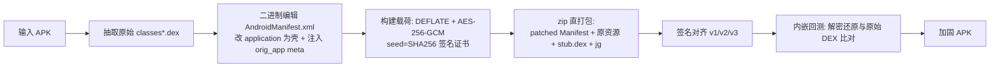

# JGShield —— 差异化 APK 一键加固工具

[](#安全声明)

JGShield 是一个参考开源项目 *mocika-shield* 的设计目标、但实现**完全独立**的 APK 加壳（加固）工具。
核心诉求：**逆向者即使看过参考项目，也无法直接照搬到本项目上攻破**。

设计上通过「算法差异 + 载荷藏匿方式差异 + 密钥派生差异 + 加载方式差异 + 反调试差异」组合，
使任何"照抄参考项目破解步骤"的尝试失效。加固后 APK 在真机可正常运行（已通过华为 / vivo / 小米等机型验证）。

---

## ✨ 差异化设计（与 mocika-shield 的关键区别）

| 维度 | mocika-shield | JGShield |
|------|---------------|----------|
| 对称加密 | ChaCha20-Poly1305 + Zstd | **AES-256-GCM (AEAD) + DEFLATE** |
| 载荷藏匿 | `assets/app.bin` | **自定义顶层 ZIP 条目 `jg`，魔数 `JGS1`**；`classes.dex` 保持标准干净壳 DEX，任何反编译/安装工具都不会因尾部垃圾数据报错 |
| 密钥派生 | HKDF + 随机 IKM | **`seed = SHA256(签名证书DER)`**，再 `HMAC-SHA256(seed, "JG\|dex"+i)` 派生每 DEX 独立密钥；**换签 / 重签即解密失败（抗篡改）** |
| 加载 | Rust native 注入 | **纯 Java `PathClassLoader` 注入 + 替换 `LoadedApk`/`ActivityThread` 的 Application 与 ClassLoader** |
| 反调试 | — | 启动期对 `/proc/self/maps` 做 Frida/Substrate/Xposed 特征扫描 + `Debug.isDebuggerConnected` |

> 完整的差异化要点也写在 `src/java/com/jiagu/shield/ShieldApplication.java` 的类注释里。

---

## 🔧 加固流程（方向 B：二进制 Manifest 编辑 + zip 直打包，绕过 apktool）



关键实现选择：

- **不解码 / 重编资源**。直接操作 AXML 二进制（见 `axml_editor.py`），大包加固从 ~5–10 分钟降到秒级。
- **载荷不在 assets、不在 dex 尾部**，而是作为自定义顶层 ZIP 条目 `jg`；`classes.dex` 始终是一份干净的壳 DEX，规避各类工具对"异常结构"的报错。
- **密钥与签名绑定**：壳在运行期通过 `PackageManager` 读取同一签名证书派生密钥，开发者换签名证书后旧包无法解密（天然防重打包）。
- **原生库命名空间（方案 B）**：解密后的 DEX 注入框架 `sysLoader` 的 `dexElements`（而非新建 `PathClassLoader`），使原 App 留在主 `classloader-namespace`，原生库 `.so` 解析与未加固完全一致（修复了 `UnsatisfiedLinkError: ... not accessible for namespace "clns-N"`）。

---

## 🛡️ 安全设计要点

- **加密链路**：AES-256-GCM（认证加密，防篡改）+ DEFLATE。
- **密钥派生**：`seed = SHA256(签名证书DER)`；`per-dex key = HMAC-SHA256(seed, "JG|dex"+i)`。换签即解密失败。
- **载荷藏匿**：自定义顶层 ZIP 条目 `jg` + 魔数 `JGS1`；`classes.dex` 保持干净壳 DEX。
- **反调试**：`/proc/self/maps` 特征扫描（frida / substrate / xposed / libsandhook / libmsaoaidsec）+ `Debug.isDebuggerConnected`。
- **多进程竞态防护**：解密 DEX 先检查已有文件直接复用；`writeFileAtomic` 用 `.tmp + sync + rename` 原子写入，防止并发写导致 DEX 验证器 SIGBUS。

> ⚠️ **已知短板**：当前**运行时防护**较弱——Frida 改名注入 / 延迟注入、以及内存中明文 DEX 被 dump 暂未防护（详见「已知局限」）。加密链路本身是扎实的。

---

## 📁 项目结构

```
JGShield/
├── src/java/com/jiagu/shield/ShieldApplication.java   # 加固壳（编译为 stub.dex）
├── harden.py              # 加固核心：DEX 收集→Manifest 改写→加密载荷→zip 直打包→签名→回测
├── axml_editor.py         # 二进制 AXML 编辑器（改 application / 注入 meta-data，不经 apktool）
├── config.py              # 共享配置（路径解析、工具/密钥位置、壳常量，必须与 Java 壳保持一致）
├── batch_harden.py        # 批量加固入口（扫描目录逐个加固 + 静态回测 + 汇总报告）
├── verify.py              # 静态回测 A/B/C/D（载荷还原 / Manifest / 可打包性 / 签名）
├── verify_payload.py      # 载荷解密比对（被 harden.py 与 verify.py 复用）
├── device_check.py        # 真机/模拟器运行期验证（安装→启动→前台检测→崩溃检测）
├── gen_samples.py         # 生成结构多样的测试 APK（用于端到端回测）
├── test_repack.py         # 临时诊断脚本（硬编码路径，仅供排障，非交付物）
├── jiagu_gui.py           # tkinter 桌面 GUI（一键加固 / 静态回测 / 真机验证）
├── jiagu_gui.spec         # PyInstaller 打包配方（datas 含 tools/* 与 stub.dex）
├── build_exe.bat          # 一键构建 exe（建 venv → 编 stub.dex → 杀旧进程 → pyinstaller）
├── setup_tools.bat        # 从本地 Android SDK 补齐 tools/ 外部依赖（不进 git 的二进制）
├── run_gui.bat            # 开发态启动 GUI
└── .gitignore
```

> `tools/`（约 57MB 二进制工具）与 `build/`、`dist/`、`output/`、`test_apks/` 等均被 `.gitignore` 排除，
> 仓库保持精简。**clone 后先跑 `setup_tools.bat` 补齐依赖即可开箱即用。**

---

## 🧰 环境依赖

| 依赖 | 用途 | 备注 |
|------|------|------|
| Python **3.8.10** | 运行 / 打包 GUI | 必须用 3.8.10，因为打包用的 venv 需要 tkinter；3.13 venv 无 tkinter |
| JDK 11+ | 运行 apktool / uber-apk-signer / apksigner / d8 | `config.py` 自动探测常见安装路径，否则回退到 `PATH` 的 `java` |
| Android SDK build-tools | `aapt.exe` | `setup_tools.bat` 从本地 SDK 复制 |
| `apktool.jar` / `uber-apk-signer.jar` / `android.jar` / `d8.jar` | 资源解码 / 签名 / 编译壳 DEX | 由 `setup_tools.bat` 下载或复制 |
| `javac`（JDK 自带） | 将壳 Java 编译为 `stub.dex` | — |

---

## 🚀 快速开始

```bat
git clone https://github.com/JianGsHanz/JGShield.git
cd JGShield

:: 1) 补齐外部依赖（aapt/adb/apksigner/d8/android.jar + 下载 apktool/uber-apk-signer + 生成测试密钥）
setup_tools.bat

:: 2) 构建桌面 exe（可选；不构建也能直接 python 跑 CLI）
build_exe.bat
```

构建产物：`dist/jiagu_gui.exe`（双击即用）。也可直接以源码方式运行（见下）。

---

## 💻 用法

### 命令行（CLI）

```bat
:: 单个 APK 加固
python harden.py input.apk -o output/hardened_input.apk

:: 批量加固整个目录（逐个静态回测）
python batch_harden.py --input-dir test_apks --output-dir output

:: 静态回测（A 载荷还原 / B Manifest / C 可打包性 / D 签名）
python verify.py output/hardened_x.apk test_apks/x.apk

:: 真机/模拟器运行期验证（安装→启动→前台检测→崩溃检测）
python device_check.py output/hardened_x.apk --target <设备序列号>

:: 生成结构多样的测试 APK（约 10 个，覆盖自定义 Application / 多 DEX / assets / lib）
python gen_samples.py
```

### 图形界面（GUI）

```bat
:: 开发态
pythonw jiagu_gui.py
:: 或双击 run_gui.bat

:: 已构建的可执行文件
dist/jiagu_gui.exe
```

GUI 提供「一键加固 / 静态回测 / 真机验证」三块能力，底部实时日志 + 进度条，任务在后台线程运行不卡界面。

### 自定义签名密钥

加固支持用你自己的密钥库（默认用内置测试证书 `common.jks`，仅用于自测，**发布前务必替换**）：

```bat
python harden.py input.apk --ks my.keystore --ksAlias myalias --ksPass <密码> --ksKeyPass <密码>
```

密钥库证书用于派生种子，且壳在运行期读取**同一证书**解密，因此「换签名证书」会导致设备上解密失败（即抗重打包）。

---

## 📦 构建 exe（可选）

`build_exe.bat` 一条命令完成：建 `_build_venv`（Python 3.8.10 + pyinstaller + pycryptodome）
→ `javac --release 8` + `d8` 编译 `stub.dex`
→ 杀掉运行中的旧 exe（避免文件锁）
→ 设 `PYTHONPATH=_noop_sc` 绕过删除拦截
→ `pyinstaller jiagu_gui.spec`。

> 说明：`exe` 不进 git（体积大、可重建）。仓库保存的是 `jiagu_gui.spec` 配方 + 源码；需要分发的，走 **GitHub Releases** 上传 `dist/jiagu_gui.exe` 作为 asset。

---

## ⚠️ 已知局限 / 规划中的补强

1. **运行时防护短板（待补强）**：当前反调试为启动期一次性扫描，且解密后的明文 DEX 驻留内存。
   对 *frida-gadget 改名注入 / 延迟注入 / hook 检测函数* 与 *内存 dump* 暂未防护。
   补强方向：反 Frida 周期轮询（端口 27042 / `/data/local/tmp/re.frida.server`） + DEX 分段加载即时清零 + 关键逻辑 native 化。
2. **`logcat` 中的 `ClassNotFoundException: androidx.core.app.CoreComponentFactory`**：无害。
   Android 9+ 系统在 `makeApplication()` 早于 `attachBaseContext` 加载 `android:appComponentFactory` 指定的类，
   此时 DEX 尚未注入，被系统 catch 后回退默认工厂，不影响运行。
3. **原生库命名空间**：已通过方案 B（DEX 注入 `sysLoader`）解决，原 App 原生库解析与未加固一致。

---

## 📜 安全声明

本项目**仅供学习研究，以及加固你拥有合法权限的自有应用**。

- 请勿用于加固来路不明或侵犯第三方权益的 APK。
- 加固不能替代应用层安全（通信加密、敏感数据保护等）。
- 加壳可提高逆向门槛，但无法做到「绝对不可破」——任何加固都只是提高攻击成本。

---

## 📄 License

本项目当前未指定开源许可证，仅供个人学习与研究使用。如需用于其他用途，请先联系作者。
