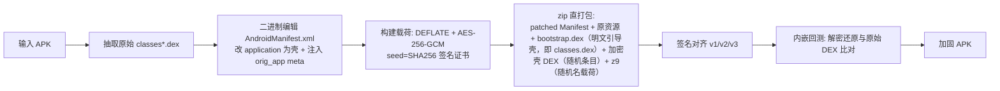

# JGShield —— 差异化 APK 一键加固工具

[](#安全声明)

JGShield 是一个参考开源项目 *mocika-shield* 的设计目标、但实现**完全独立**的 APK 加壳（加固）工具。
核心诉求：**逆向者即使看过参考项目，也无法直接照搬到本项目上攻破**。

设计上通过「算法差异 + 载荷藏匿方式差异 + 密钥派生差异 + 加载方式差异 + 反调试差异」组合，
使任何"照抄参考项目破解步骤"的尝试失效。加固后 APK 在真机可正常运行（已通过华为 / 小米真机验证）。

---

## ✨ 差异化设计（与 mocika-shield 的关键区别）

| 维度 | mocika-shield | JGShield |
|------|---------------|----------|
| 对称加密 | ChaCha20-Poly1305 + Zstd | **AES-256-GCM (AEAD) + DEFLATE** |
| 载荷藏匿 | `assets/app.bin` | **自定义顶层 ZIP 条目（由 `stamp.py` 随机命名，如 `z9`/`aa1`）**；`classes.dex` 现为**明文引导壳 `GxBootstrap`**，原壳 DEX 已 AES-GCM 加密进另一随机条目，任何反编译/安装工具都不会因尾部垃圾数据报错 |
| 密钥派生 | HKDF + 随机 IKM | **`seed = SHA256(签名证书DER)`**，再 `HMAC-SHA256(seed, "JG\|dex"+i)` 派生每 DEX 独立密钥；**换签 / 重签即解密失败（抗篡改）** |
| 加载 | Rust native 注入 | **纯 Java 注入（方案 B：`InMemoryDexClassLoader` 解密后的 DEX 注入框架 `sysLoader` 的 `dexElements`，保留原生库命名空间）+ 反射替换 `ActivityThread` 的 Application 与 ClassLoader** |
| 反调试 | — | 启动期对 `/proc/self/maps` 做 Frida/Substrate/Xposed 特征扫描 + `Debug.isDebuggerConnected` |
| 壳指纹 | 包名/类名/字符串明文（易被 strings/grep 定位） | **壳指纹随机化（P7）**：每次加固由 `stamp.py` 随机生成包名 / 13 个壳类名 / 敏感字符串 / 魔数 / 运行期 TAG / native 日志 tag / 载荷 ZIP 条目名，原始固定特征（`com.gx.runtime`、`gx.*`、`JGS1`、`JG-`）已彻底消除；`Obf` 字符串走 native 解码（密钥仅存 `.so`） |

> 完整的差异化要点也写在 `src/java/com/gx/runtime/GxApp.java` 的类注释里。

---

## 🔧 加固流程（方向 B：二进制 Manifest 编辑 + zip 直打包，绕过 apktool）



关键实现选择：

- **不解码 / 重编资源**。直接操作 AXML 二进制（见 `axml_editor.py`），大包加固从 ~5–10 分钟降到秒级。
- **载荷不在 assets、不在 dex 尾部**，而是作为自定义顶层 ZIP 条目（由 `stamp.py` 随机命名，如 `z9`）；`classes.dex` 现为**明文引导壳 `GxBootstrap`**，原壳 DEX 已 AES-GCM 加密进另一随机条目，规避各类工具对"异常结构"的报错。
- **密钥与签名绑定**：壳在运行期通过 `PackageManager` 读取同一签名证书派生密钥，开发者换签名证书后旧包无法解密（天然防重打包）。
- **原生库命名空间（方案 B）**：解密后的 DEX 注入框架 `sysLoader` 的 `dexElements`（而非新建 `PathClassLoader`），使原 App 留在主 `classloader-namespace`，原生库 `.so` 解析与未加固完全一致（修复了 `UnsatisfiedLinkError: ... not accessible for namespace "clns-N"`）。

---

## 🛡️ 安全设计要点

- **加密链路**：AES-256-GCM（认证加密，防篡改）+ DEFLATE。
- **密钥派生**：`seed = SHA256(签名证书DER)`；`per-dex key = HMAC-SHA256(seed, "JG|dex"+i)`。换签即解密失败。
- **载荷藏匿**：自定义顶层 ZIP 条目（由 `stamp.py` 随机命名，如 `z9`）+ 随机魔数；`classes.dex` 现为明文引导壳 `GxBootstrap`。
- **反调试**：`/proc/self/maps` 特征扫描（frida / substrate / xposed / libsandhook / libmsaoaidsec）+ `Debug.isDebuggerConnected`。
- **反篡改守护（AntiTamper，保命版）**：独立后台守护线程，与加载器物理隔离、整段 try-catch、绝不导致 App 闪退。周期轮询：
  - `/proc/self/maps` 扩展特征扫描（frida / gadget / libfrida / frida-agent / substrate / xposed / libsandhook / libmsaoaidsec / libnativehook / cydia / magisk / re.frida / frida-server）
  - frida 默认端口 `27042 / 27043` 探测
  - `/data/local/tmp/re.frida.server` 文件存在性
  - `/proc/self/status` 的 `TracerPid`（ptrace 检测）
  - 命中即按 `STRENGTHEN_RESPONSE` 统一响应（默认 `log`=仅记录不阻断，fail-safe 避免误杀正常设备；加固期注入 `gx.strengthen=exit` 可改为阻断）
  - 开关：`GxApp.ANTI_TAMPER_ENABLED`（改 `false` + 重编 stub.dex / bootstrap.dex 即全关）
- **多进程竞态防护**：解密 DEX 先检查已有文件直接复用；`writeFileAtomic` 用 `.tmp + sync + rename` 原子写入，防止并发写导致 DEX 验证器 SIGBUS。
- **壳指纹随机化（P1 混淆 + P7 全量随机）**：每次加固由 `stamp.py` 随机生成包名 / 全部壳类名 / 魔数 / 运行期 TAG / native 符号 / 载荷 ZIP 条目名 / meta 键，原始固定特征（`com.gx.runtime`、`gx.*`、`JGS1`、`JG-`）已彻底消除；敏感字符串走 `Obf` native 解码（密钥仅存 `.so`）。DEX 二进制静态扫描无可定位指纹，可挫败照抄破解步骤与按特征自动识别。**边界**：`Obf` 为混淆非加密，不防 jadx 人工分析。
- **反内存 dump 检测（P-ANTIDUMP）**：`GxAntiDump` 守护线程启动即查 + 周期轮询，检测 FART/Youpk/BlackDex 等脱壳工具的默认 dump 产物路径（app 数据目录下的 `dump`/`app_dump`/`dexdump`/`dump_dex` 目录、`/data/local/tmp` 下的 `blackdex`/`youpk`/`fart` 标记文件），命中收口 `STRENGTHEN_RESPONSE`。**边界**：仅挡默认配置脱壳工具，改路径的定制工具挡不住；根治需 VMP 指令虚拟化，未做；此外壳自身 DEX 已 AES-GCM 加密（P8 双壳），静态提取仅得密文。

- **双壳自加密（P8）**：Manifest 入口为极简明文引导壳 `GxBootstrap`（`classes.dex`），它解密并注入经 AES-256-GCM 加密的原壳 DEX（随机 ZIP 条目），再反射随机名 `GxApp.boot(base, proxy)` 驱动原壳逻辑，并持有原 App 转发 5 个生命周期。壳自身不再明文裸露，进一步对抗「熟悉开源方案者直接提取壳 DEX 分析」；密钥派生同源（`seed=SHA256(证书DER)`，`per-dex` 用 `JG|dex`、壳 DEX 用 `JG|shell`，均带 idx），换签即解密失败。

- **防抓包（P-CAPTURE，代码待命、默认未启用）**：`GxPinning` 支持按 `gx.ssl_pins` 配置 SPKI 指纹固定，`GxProxy` 检测系统代理/VPN，二者统一收口 `STRENGTHEN_RESPONSE`（默认 `log` 仅记录）。因证书轮换顾虑未配 pin；X5 WebView 与自定义 TrustManager 的 OkHttp 为机制盲区，故当前防抓包处于"检测可见、不阻断"的半开状态。

> ⚠️ **已补强 P1/P2，但仍有的边界**：反 Frida（P1 native 层 + Java 周期轮询）与 DEX fileless 内存加载（P2，磁盘不落明文、不生成 odex）已完成；但**运行期内存 dump 仍未 100% 防护**——DEX 被 ART 加载后优化代码必在进程内存，frida-dexdump 仍可扫到。要做到"运行期明文不驻留内存"需 P3 指令抽取（native hook ART，高风险，未做）。加密链路本身扎实。（注：P8 已对壳自身 DEX 加密，静态提取进一步加固；但运行期明文仍驻留内存，此点未变。）

---

## 📁 项目结构

```
JGShield/
├── src/java/com/gx/runtime/GxApp.java                # 加固壳主类（编译为加密壳 DEX，运行期由引导壳解密；已做自身混淆：类名/字符串/native 符号随机化）
├── src/java/com/gx/runtime/GxBootstrap.java           # P8 双壳引导壳（明文 classes.dex 入口，解密并注入加密壳 DEX，转发生命周期）
├── harden.py              # 加固核心：DEX 收集→Manifest 改写→加密载荷→zip 直打包→签名→回测
├── axml_editor.py         # 二进制 AXML 编辑器（改 application / 注入 meta-data，不经 apktool）
├── config.py              # 共享配置（路径解析、工具/密钥位置、壳常量，必须与 Java 壳保持一致）
├── batch_harden.py        # 批量加固入口（扫描目录逐个加固 + 静态回测 + 汇总报告）
├── verify.py              # 静态回测 A/B/C/D（载荷还原 / Manifest / 可打包性 / 签名）
├── verify_payload.py      # 载荷解密比对（被 harden.py 与 verify.py 复用）
├── device_check.py        # 真机/模拟器运行期验证（安装→启动→前台检测→崩溃检测）
├── gen_samples.py         # 生成结构多样的测试 APK（用于端到端回测）
├── test_repack.py         # 临时诊断脚本（硬编码路径，仅供排障，非交付物）
├── jiagu_gui.py           # tkinter 桌面 GUI（一键加固 / 静态回测 / 真机验证）
├── jiagu_gui.spec         # PyInstaller 打包配方（datas 含 tools/* 与 stub.dex / bootstrap.dex）
├── build_exe.bat          # Windows 一键构建 exe（建 venv → 编 stub.dex + bootstrap.dex → 杀旧进程 → pyinstaller）
├── setup_tools.bat        # Windows：从本地 Android SDK 补齐 tools/ 外部依赖（不进 git 的二进制）
├── run_gui.bat            # Windows 开发态启动 GUI
├── build_exe.sh           # macOS/Linux 构建 .app（或可执行文件）
├── setup_tools.sh         # macOS/Linux：从 Android SDK 补齐 tools/ 依赖
├── run_gui.sh             # macOS/Linux 开发态启动 GUI
└── .gitignore
```

> `tools/`（约 57MB 二进制工具）与 `build/`、`dist/`、`output/`、`test_apks/` 等均被 `.gitignore` 排除，
> 仓库保持精简。**clone 后：Windows 跑 `setup_tools.bat`、macOS/Linux 跑 `./setup_tools.sh` 补齐依赖即可开箱即用。**

---

## 🧰 环境依赖

| 依赖 | 用途 | 备注 |
|------|------|------|
| Python **3.8.10**（Windows）/ 任意带 tkinter 的 python3（macOS·Linux） | 运行 / 打包 GUI | Windows 打包必须用 3.8.10（其 venv 含 tkinter，3.13 venv 无）；macOS 建议 `brew install python`（系统自带 python 无 tkinter） |
| JDK 11+ | 运行 apktool / uber-apk-signer / apksigner / d8 | `config.py` 自动探测常见安装路径，否则回退到 `PATH` 的 `java` |
| Android SDK build-tools | `aapt.exe` | `setup_tools.bat` 从本地 SDK 复制 |
| `apktool.jar` / `uber-apk-signer.jar` / `android.jar` / `d8.jar` | 资源解码 / 签名 / 编译壳 DEX | 由 `setup_tools.bat` 下载或复制 |
| `javac` + `d8`（JDK/Android SDK 自带） | `build_stub.py` 分两次编译：`GxApp`+`GxGuard`→加密壳 `stub.dex`、`GxBootstrap`→明文 `bootstrap.dex` | — |
| Android NDK（r25+） | 编译 4 ABI 随机名 native `.so`（`build_stub.py` 运行时按随机包名重编） | 优先读 `ANDROID_NDK_HOME` 环境变量；未设则回退到 Windows 硬编码路径 `D:/Android/AndoridSDK/ndk/25.1.8937393`。**macOS/Linux 必须设置 `ANDROID_NDK_HOME`**（无 Windows 回退），且 NDK 预编译工具链子目录随平台自动选择（`darwin-x86_64` / `darwin-arm64` / `linux-x86_64` / `windows-x86_64`），clang 在 macOS/Linux 无 `.cmd` 后缀 |

---

## 🚀 快速开始

```bat
git clone https://github.com/JianGsHanz/JGShield.git
cd JGShield

:: 1) 补齐外部依赖（aapt/adb/apksigner/d8/android.jar + 下载 apktool/uber-apk-signer + 生成测试密钥）
setup_tools.bat

:: 2) 构建桌面 exe（可选；不构建也能直接 python 跑 CLI）
build_exe.bat
```

构建产物：`dist/jiagu_gui.exe`（双击即用）。也可直接以源码方式运行（见下）。

---

## 🍎 macOS / Linux 支持

> ⚠️ **未经真机/真实环境实测**：本项目的 macOS / Linux 支持（含 `build_exe.sh` 打包 `.app`、跨平台工具链适配）**仅通过代码与脚本静态校验，从未在真实 Mac/Linux 主机上跑通构建**。按现有代码与文档估算，构建出 `.app` 的成功率约 **60–70%**，失败点大概率在 PyInstaller + macOS + tkinter 打包组合及 JDK/SDK 工具链，而非加固逻辑本身。如需在 Mac/Linux 上使用，请严格按下方步骤准备环境，并把构建报错反馈以便修正。

核心加固逻辑（壳 Java + Python）本身跨平台。原生工具二进制由 `config.py` 按 `sys.platform` 自动适配：

- `aapt` / `adb` / `keytool` 文件名（Windows 加 `.exe`，macOS/Linux 无扩展名）与 JDK/SDK 路径自动选择。
- `apktool.jar` / `uber-apk-signer.jar` / `apksigner.jar` / `d8.jar` / `android.jar` 均为 Java jar，**跨平台通用**。

### 准备依赖

```bash
git clone https://github.com/JianGsHanz/JGShield.git
cd JGShield

# 1) 补齐外部依赖（从 Android SDK 复制 darwin 版 aapt/adb/apksigner/d8/android.jar + 下载 apktool/uber-apk-signer + 生成测试密钥）
./setup_tools.sh

# 2) 构建桌面 .app（可选；不构建也能直接 python 跑 GUI）
./build_exe.sh
```

构建产物：macOS 为 `dist/jiagu_gui.app`（双击即用）；Linux 为 `dist/jiagu_gui`。

### 直接以源码运行（无需打包）

```bash
python3 jiagu_gui.py          # 开发态 GUI
# 或
./run_gui.sh
```

> ⚠️ **aapt 提示**：新版 Android SDK（build-tools 30+）只提供 `aapt2`、不再含 `aapt`。
> `setup_tools.sh` 会尽力复制 darwin 版 `aapt`；若复制不到会给出提示。
> **aapt 仅用于真机验证(`device_check.py`)与静态回测(`verify.py`)提取包名**，加固核心路径（zip 直打包）不依赖它——
> 因此缺 `aapt` 仅影响「真机/回测」功能，不影响 `harden.py` 加固本身。
> 需要完整功能时，从旧版 build-tools 复制 darwin 版 `aapt` 到 `tools/aapt`，或 `brew install android-sdk`。

---

## 💻 用法

### 命令行（CLI）

```bat
:: 单个 APK 加固
python harden.py input.apk -o output/hardened_input.apk

:: 批量加固整个目录（逐个静态回测）
python batch_harden.py --input-dir test_apks --output-dir output

:: 静态回测（A 载荷还原 / B Manifest / C 可打包性 / D 签名）
python verify.py output/hardened_x.apk test_apks/x.apk

:: 真机/模拟器运行期验证（安装→启动→前台检测→崩溃检测）
python device_check.py output/hardened_x.apk --target <设备序列号>

:: 生成结构多样的测试 APK（约 10 个，覆盖自定义 Application / 多 DEX / assets / lib）
python gen_samples.py
```

### 图形界面（GUI）

```bat
:: 开发态
pythonw jiagu_gui.py
:: 或双击 run_gui.bat

:: 已构建的可执行文件
dist/jiagu_gui.exe
```

GUI 提供「一键加固 / 静态回测 / 真机验证」三块能力，底部实时日志 + 进度条，任务在后台线程运行不卡界面。

### 自定义签名密钥

加固支持用你自己的密钥库（默认用内置测试证书 `common.jks`，仅用于自测，**发布前务必替换**）：

```bat
python harden.py input.apk --ks my.keystore --ksAlias myalias --ksPass <密码> --ksKeyPass <密码>
```

密钥库证书用于派生种子，且壳在运行期读取**同一证书**解密，因此「换签名证书」会导致设备上解密失败（即抗重打包）。

---

## 📦 构建 exe（可选）

`build_exe.bat` 一条命令完成：建 `_build_venv`（Python 3.8.10 + pyinstaller + pycryptodome）
→ `javac --release 8` + `d8` 编译 `stub.dex` 与 `bootstrap.dex`（由 `build_stub.py` 分两次编）
→ 杀掉运行中的旧 exe（避免文件锁）
→ 设 `PYTHONPATH=_noop_sc` 绕过删除拦截
→ `pyinstaller jiagu_gui.spec`。

> 说明：`exe` 不进 git（体积大、可重建）。仓库保存的是 `jiagu_gui.spec` 配方 + 源码；需要分发的，走 **GitHub Releases** 上传 `dist/jiagu_gui.exe` 作为 asset。

---

## ⚠️ 已知局限 / 规划中的补强

1. **运行时防护（已补强 P1 + P2 + P7 + P8）**：
   - ✅ **反 Frida 已补强（保命版）**：启动期一次性扫描 → 升级为 `AntiTamper` 后台守护线程周期轮询（maps 扩展特征 / frida 端口 27042·27043 / `/data/local/tmp/re.frida.server` / `TracerPid`），可捕获改名注入与延迟注入；命中即退出，干净设备零影响。
   - ✅ **原生层反篡改（P1）**：随机名 native 库（NDK 编译，JNI 守护线程；原固定名 `libjgguard.so` 已被 P7 随机名替代以抹特征）下沉到 native，比 Java `AntiTamper` 更难被 frida hook，二者互为备份；加载失败仅降级，不影响启动。
   - ✅ **DEX fileless 内存加载（P2）**：API≥26 时解密进 `ByteBuffer`，经公开 API `InMemoryDexClassLoader` 在内存中加载并注入框架 `sysLoader`（保留原生库命名空间），**磁盘不落明文 DEX 文件、不生成 odex**（关掉了"读明文文件/备份"这一类最易利用的泄漏）；解密后源 `byte[]` 立即清零。API<26 自动回退原文件方案（不回归）。
   - ⚠️ **运行期内存 dump 仍未 100% 防护**：DEX 一旦被 ART 加载运行，优化后的代码必存在于进程内存，frida-dexdump 等仍可扫到。当前 P2 已关闭**磁盘明文**与**启动期整段明文大块**两个泄漏点，并已加 **`GxAntiDump` 检测层**（拦默认配置脱壳工具）；但要做到"运行期明文 DEX 不驻留内存"，必须做 **DEX 指令抽取（native 层 hook ART 方法，按需解密/还原方法字节码）**——该方案版本相关、极易崩，属独立的**高风险 P3**。方法级抽取（P3.2 批量还原）已落地但覆盖率有限；壳自身 DEX 已在 P8 加密，静态提取无法获得明文壳。
   - 待规划：P3 指令抽取（需独立真机验证）、关键逻辑 native 化深化。
2. **`logcat` 中的 `ClassNotFoundException: androidx.core.app.CoreComponentFactory`**：无害。
   Android 9+ 系统在 `makeApplication()` 早于 `attachBaseContext` 加载 `android:appComponentFactory` 指定的类，
   此时 DEX 尚未注入，被系统 catch 后回退默认工厂，不影响运行。
3. **原生库命名空间**：已通过方案 B（DEX 注入 `sysLoader`）解决，原 App 原生库解析与未加固一致。
4. **assets/ 加密（实验性、默认关闭）**：
   - 加固核心支持把原始 `assets/` 加密进 `z9` 载荷并从 APK 剥离（关闭资源明文泄漏），运行时由壳解密还原进 `AssetManager`。
   - **默认不开启**（CLI 需显式 `--assets-encrypt`）：因为运行时还原依赖反射绕过隐藏 API 合并 `AssetManager`，在部分 OEM/高版本 ROM 上可能失败，失败后 App 会缺资源而崩。
   - 若开启后某 App 报 assets 缺失/资源找不到，**去掉 `--assets-encrypt` 重新加固即可恢复**（assets 留在 APK 内，与未加固行为一致）。

---

## 📜 安全声明

本项目**仅供学习研究，以及加固你拥有合法权限的自有应用**。

- 请勿用于加固来路不明或侵犯第三方权益的 APK。
- 加固不能替代应用层安全（通信加密、敏感数据保护等）。
- 加壳可提高逆向门槛，但无法做到「绝对不可破」——任何加固都只是提高攻击成本。

---

## 📄 License

本项目当前未指定开源许可证，仅供个人学习与研究使用。如需用于其他用途，请先联系作者。
